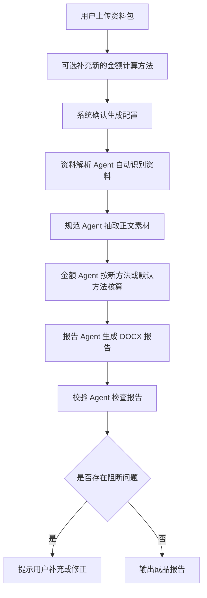

# 基于Agent和大模型的绩效考核报告生成系统PRD

## 1. 文档信息

| 项目 | 内容 |
| --- | --- |
| 产品名称 | 农村污水PPP绩效考核报告生成系统 |
| 文档类型 | 产品需求文档 PRD |
| 目标版本 | V1.1 |
| 核心场景 | 上传资料包，自动生成正式绩效考核报告 |
| 输入 | 资料包；新的金额计算方法为选填 |
| 输出 | 成品 DOCX 报告 |

## 2. 产品定位

本产品是面向农村污水PPP绩效考核场景的正式报告生成工具。用户收到对方发送的一个或多个镇街资料包后，只需上传资料包，系统即自动完成资料识别、数据抽取、金额核算、正文生成和格式校验，最终输出可编辑的正式 DOCX 报告。

产品入口应尽量简单，不让用户理解“技能、底稿、金额基数、公共资料”等内部概念。新的金额计算方法仅作为选填项存在：如果用户没有提供新的金额计算方法，系统必须自动使用默认金额计算方法继续生成，不得因此阻断流程。

## 3. 产品目标

1. 支持上传一个或多个镇街资料包。
2. 支持选填新的金额计算方法，包括合同、补充协议、金额计算表或文字说明。
3. 未提供新的金额计算方法时，系统自动使用默认金额计算方法。
4. 系统自动识别镇街、资料类型、公共资料和附件内容。
5. 系统自动计算 Ec1、Ec2、可用性付费、运维服务费、扣减金额和合计金额。
6. 系统按正式正文底稿生成成品 DOCX 报告。
7. 用户最终主要获得成品报告；金额过程、校验清单和 Agent 日志作为详情查看。

## 4. 用户与场景

| 用户角色 | 主要诉求 |
| --- | --- |
| 报告编制人员 | 快速把资料包转成正式报告 |
| 审核人员 | 在必要时查看金额过程和校验结果 |
| 项目负责人 | 批量生成多镇街报告和汇总报告 |
| 外部协作人员 | 按要求提交资料包后获得统一格式报告 |

典型场景：

1. 单镇报告：上传一个镇的资料包，系统生成该镇正式报告。
2. 多镇报告：上传多个镇街资料包，系统批量生成多个正式报告。
3. 汇总报告：资料包包含多个镇街时，用户可选择同时生成全市汇总报告。
4. 新金额规则：如本次收到新的金额计算方法，用户可上传或填写；如未收到，系统使用默认金额计算方法。

## 5. 输入与输出

### 5.1 输入

| 输入项 | 是否必填 | 说明 |
| --- | --- | --- |
| 资料包 | 必填 | 对方发送的一个或多个镇街资料包，可类似“资料收集”文件夹 |
| 新的金额计算方法 | 选填 | 仅当本次存在新的合同、补充协议、金额计算表或特殊计算说明时提供 |

资料包可包含：

```text
资料收集
├─ 公共资料
│  └─ 公共资料.docx
├─ 金额基础数据.xlsx（如有）
├─ 北陡镇
│  └─ 北陡镇附件资料.docx
└─ 其他镇街资料
```

规则：如果用户未提供新的金额计算方法，系统自动使用默认金额计算方法继续生成。资料包内如存在金额基础数据，系统可自动识别并作为依据；如不存在，不要求用户额外补充。

### 5.2 输出

| 输出项 | 说明 |
| --- | --- |
| 成品 DOCX 报告 | 主输出，供用户下载、提交和继续编辑 |
| 生成详情 | 辅助信息，包括金额过程、资料识别结果、校验清单和 Agent 日志 |

## 6. 核心业务规则

1. 正式报告中的镇街名称、设施名称、评分、水质、满意度、问题和金额均来自本次资料包及适用金额计算方法。
2. 原正文只作为模板和格式参考，历史数据默认视为不存在。
3. 单镇报告不得出现其他镇街名称和跨镇共性问题举例。
4. 多镇或总报告需要写共性问题分析，举例只能来自本次资料包范围。
5. 新的金额计算方法优先级高于默认金额计算方法。
6. 未提供新的金额计算方法时，必须使用默认金额计算方法，不得要求用户另外寻找金额规则。
7. 生成结果以成品报告为中心，计算过程和校验内容默认收纳在详情中。

## 7. Agent 设计

| Agent | 职责 | 输入 | 输出 |
| --- | --- | --- | --- |
| 主控 Agent | 理解任务、编排流程、汇总结果 | 资料包、选填金额方法 | 任务计划、最终报告 |
| 资料解析 Agent | 识别资料结构、镇街、附件和公共资料 | DOCX、XLSX、PDF、图片 | 结构化资料索引 |
| 规范 Agent | 抽取正式报告正文素材 | 评分、水质、满意度、资料核查、问题描述 | 正文素材 |
| 金额 Agent | 计算 Ec1/Ec2 和服务费；无新方法时使用默认方法 | 评分、默认方法、选填新方法 | 金额结果 |
| 报告 Agent | 套用正式底稿生成 DOCX | 正文素材、金额结果、底稿 | 成品报告 |
| 校验 Agent | 检查结构、金额、表格、命名和残留 | 成品报告、计算结果 | 校验详情 |

## 8. 功能需求

### 8.1 上传与引导

| 编号 | 需求 | 优先级 |
| --- | --- | --- |
| F-001 | 首页提供唯一清晰主入口“上传资料包生成报告” | P0 |
| F-002 | 支持上传资料包文件夹或多个资料文件 | P0 |
| F-003 | 新的金额计算方法为选填，默认收起 | P0 |
| F-004 | 未填写新的金额计算方法时，明确提示“将使用默认金额计算方法” | P0 |
| F-005 | 不要求用户在主流程中选择公共资料、金额基础数据、正文底稿或技能版本 | P0 |

### 8.2 自动处理

| 编号 | 需求 | 优先级 |
| --- | --- | --- |
| F-006 | 自动识别镇街和资料类型 | P0 |
| F-007 | 自动抽取评分、水质、满意度、资料核查和问题素材 | P0 |
| F-008 | 自动按新方法或默认方法进行金额核算 | P0 |
| F-009 | 自动生成单镇、多镇或汇总报告 | P0 |
| F-010 | 自动检查文件命名、表格序号、金额一致性和跨镇残留 | P0 |

### 8.3 输出与详情

| 编号 | 需求 | 优先级 |
| --- | --- | --- |
| F-011 | 结果页突出“下载成品报告”主按钮 | P0 |
| F-012 | 多报告场景支持下载全部报告 | P0 |
| F-013 | 金额过程、校验清单和 Agent 日志放入详情抽屉 | P1 |
| F-014 | 阻断异常出现时禁用下载，并提示必须处理的事项 | P0 |

## 9. 核心流程



## 10. 异常处理

| 异常 | 系统处理 |
| --- | --- |
| 未提供新的金额计算方法 | 自动使用默认金额计算方法，并在详情中说明 |
| 资料包无法读取 | 阻断生成，提示重新上传 |
| 文件名无法识别镇街 | 要求用户确认镇街名称 |
| 评分表缺失 | 生成草稿或提示需确认，金额结果标记为未定 |
| 金额差异异常 | 在详情中标红，并展示公式、基数和系数 |
| 单镇报告出现其他镇名 | 阻断正式导出，要求修复 |

## 11. 非功能需求

| 类别 | 要求 |
| --- | --- |
| 易用性 | 用户主流程不超过 4 步：上传、确认、生成、下载 |
| 准确性 | 金额公式和镇级系数可追溯、可复核 |
| 一致性 | 同一资料包多次生成结果应保持一致 |
| 容错性 | 无新金额方法时自动使用默认方法 |
| 可解释性 | 详情中可查看金额过程和校验结果 |
| 安全性 | 用户资料仅用于报告生成，不自动外发给无关服务 |

## 12. 验收标准

1. 用户进入首页后能立即看到“上传资料包生成报告”入口。
2. 用户只上传资料包、不上传新的金额计算方法时，系统能使用默认金额计算方法生成报告。
3. 用户上传新的金额计算方法时，系统能按新方法优先处理。
4. 生成过程能清晰显示当前步骤和 Agent 状态。
5. 结果页第一优先级为下载成品 DOCX 报告。
6. 金额过程和校验清单可在详情中查看，但不干扰主流程。
7. 阻断异常会阻止导出，并明确告诉用户需要处理什么。
