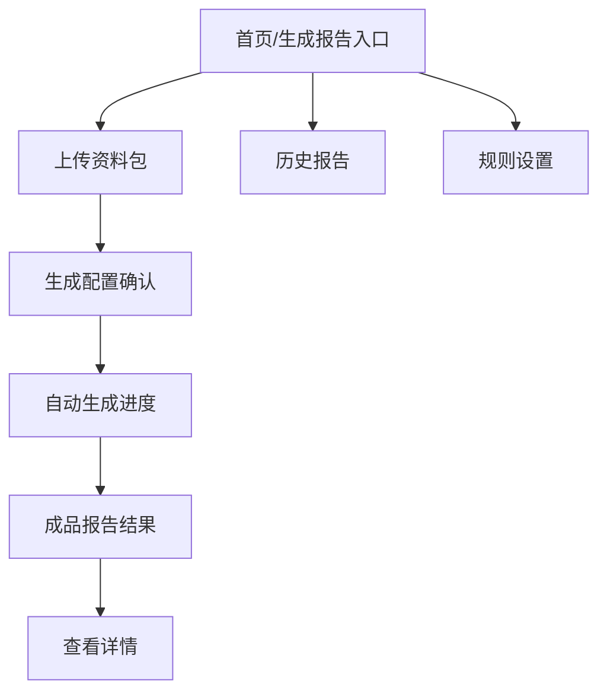

# 基于Agent和大模型的绩效考核报告生成系统原型设计文档

## 1. 原型目标

本原型面向“上传资料包并生成正式绩效考核报告”的核心流程。用户只需要完成一个必填输入和一个选填输入：

1. 必填：上传资料包。
2. 选填：新的金额计算方法。
3. 输出：成品 DOCX 报告。

如果用户没有提供新的金额计算方法，系统自动使用默认金额计算方法继续生成，不要求用户额外寻找金额表或计算规则。

## 2. 设计原则

1. 强引导：首页就让用户知道“上传资料包即可生成报告”。
2. 少选择：不把公共资料、金额基础数据、正文底稿、技能版本等内部配置暴露为主流程。
3. 自动化：资料识别、金额核算、正文生成和报告校验由系统自动完成。
4. 结果优先：结果页重点展示成品报告下载。
5. 详情后置：金额过程、校验清单和 Agent 日志放在“查看详情”中。

## 3. 信息架构



核心步骤条：

上传资料包 → 确认生成 → 自动处理 → 下载报告

## 4. 全局布局

采用简洁后台布局：

| 区域 | 内容 |
| --- | --- |
| 左侧导航 | 生成报告、历史报告、规则设置 |
| 顶部任务栏 | 产品名称、当前任务、任务状态、帮助入口 |
| 中间主区 | 当前步骤的主要操作 |
| 右侧状态栏 | 处理助手、当前 Agent、系统提示、异常状态 |

顶部帮助入口命名为“我该上传什么？”，用于解释资料包和选填金额方法。

## 5. 页面一：首页 / 生成报告入口

### 5.1 页面用途

让用户不需要寻找功能，进入页面即可开始生成报告。

### 5.2 页面原型

```text
┌────────────────────────────────────────────────────────────┐
│ 农村污水PPP绩效考核报告生成系统              我该上传什么？ │
├──────────────┬───────────────────────────────┬─────────────┤
│ 生成报告      │ 生成绩效考核报告                │ 最近报告     │
│ 历史报告      │ 上传资料包，系统自动完成资料识别、│ 台山市报告   │
│ 规则设置      │ 金额核算、正文生成和格式校验。    │ 已完成       │
│              │                               │ [下载]       │
│              │ 你只需要准备：                  │             │
│              │ 1. 资料包（必填）                │ 任务概况     │
│              │ 2. 新的金额计算方法（选填）       │ 已完成 18    │
│              │                               │ 生成中 1     │
│              │ [上传资料包生成报告]             │ 有警告 2     │
└──────────────┴───────────────────────────────┴─────────────┘
```

### 5.3 关键交互

| 操作 | 结果 |
| --- | --- |
| 点击“上传资料包生成报告” | 进入上传资料包页 |
| 点击“我该上传什么？” | 打开资料包说明弹窗 |
| 点击最近报告“下载” | 下载已生成报告 |

## 6. 页面二：上传资料包

### 6.1 页面用途

完成最少输入：资料包必填，新的金额计算方法选填。

### 6.2 页面原型

```text
┌────────────────────────────────────────────────────────────┐
│ 上传资料包                                      [开始生成] │
├──────────────────────────────────────────────┬─────────────┤
│ 资料包（必填）                                 │ 上传说明     │
│ ┌──────────────────────────────────────────┐ │ 系统会自动识别│
│ │ 拖入资料包文件夹，或点击选择               │ │ 镇街附件、公共│
│ │ 支持一个或多个镇街资料                    │ │ 资料和金额依据│
│ └──────────────────────────────────────────┘ │             │
│                                              │ 没有新金额方法│
│ 新的金额计算方法（选填）                      │ 时，将使用默认│
│ [展开上传合同/补充协议/金额计算表/填写说明]    │ 金额计算方法。│
│ 未填写时，系统将自动使用默认金额计算方法。      │             │
└──────────────────────────────────────────────┴─────────────┘
```

### 6.3 字段规则

| 字段 | 类型 | 是否必填 | 说明 |
| --- | --- | --- | --- |
| 资料包 | 文件夹/文件上传 | 是 | 对方发送的资料包 |
| 新的金额计算方法 | 文件上传/文本说明 | 否 | 没有则使用默认金额计算方法 |

### 6.4 校验规则

1. 未上传资料包时，“开始生成”不可点击。
2. 新的金额计算方法默认收起，避免干扰主流程。
3. 未填写新的金额计算方法时，显示提示：“将使用默认金额计算方法继续生成。”
4. 资料包无法读取时，进入阻断异常状态。

## 7. 页面三：生成配置确认

### 7.1 页面用途

用自然语言确认系统将如何处理，而不是让用户配置内部参数。

### 7.2 页面原型

```text
┌────────────────────────────────────────────────────────────┐
│ 生成配置确认                                      [确认生成]│
├──────────────────────────────────────────────┬─────────────┤
│ 资料包：资料收集                               │ 规则说明     │
│ 已识别：17个镇街                               │ 原正文仅作模板│
│ 新的金额计算方法：未提供                       │ 数据来自资料包│
│ 系统处理：使用默认金额计算方法                  │ 无新金额方法时│
│ 推荐输出：多个单镇报告 + 全市汇总报告           │ 使用默认方法  │
│                                              │             │
│ 输出方式  ● 按镇分别生成  ☑ 同时生成汇总报告     │             │
│ 附件处理  ● 原样追加  ○ 不追加  ○ 按目录合并     │             │
└──────────────────────────────────────────────┴─────────────┘
```

### 7.3 关键交互

| 操作 | 结果 |
| --- | --- |
| 点击“确认生成” | 进入自动生成进度页 |
| 返回上传 | 回到上传页补充资料或新的金额计算方法 |
| 勾选“同时生成汇总报告” | 输出列表增加全市汇总报告 |

## 8. 页面四：自动生成进度

### 8.1 页面用途

展示系统自动处理过程，不要求用户逐页查看识别、抽取和核算。

### 8.2 页面原型

```text
┌────────────────────────────────────────────────────────────┐
│ 正在生成报告                                      [后台生成]│
├──────────────────────────────────────────────┬─────────────┤
│ 总进度  ███████████░░░  76%                  │ 处理助手     │
│ 当前步骤：正在生成正式报告                    │ 当前Agent    │
│                                              │ 报告Agent    │
│ ✓ 读取资料包                                  │             │
│ ✓ 识别镇街和附件                              │ 系统提示     │
│ ✓ 抽取考核数据                                │ 未提供新金额 │
│ ✓ 核算金额                                    │ 方法，已使用 │
│ → 生成正文                                    │ 默认方法。   │
│ · 检查报告                                    │             │
│ · 输出成品报告                                │ [查看详情]   │
└──────────────────────────────────────────────┴─────────────┘
```

### 8.3 进度节点

1. 读取资料包
2. 识别镇街和附件
3. 抽取考核数据
4. 核算金额
5. 生成正文
6. 检查报告
7. 输出成品报告

### 8.4 异常规则

| 类型 | 展示 | 是否阻断 |
| --- | --- | --- |
| 未提供新的金额计算方法 | 黄色提示，说明已使用默认方法 | 否 |
| 资料包无法读取 | 红色提示 | 是 |
| 镇街名称无法识别 | 黄色或红色，视影响程度 | 可配置 |
| 金额异常 | 在详情中提示，必要时阻断导出 | 视情况 |

## 9. 页面五：成品报告结果

### 9.1 页面用途

突出最终成品报告下载，弱化中间过程。

### 9.2 页面原型

```text
┌────────────────────────────────────────────────────────────┐
│ 报告已生成                                      [下载全部]  │
├──────────────────────────────────────────────┬─────────────┤
│ 成品报告                                      │ 生成摘要     │
│ ┌────┬──────────────┬──────────┬────────┐    │ 资料包已处理 │
│ │序号│报告名称       │状态      │操作    │    │ 金额核算完成 │
│ ├────┼──────────────┼──────────┼────────┤    │ 报告校验通过 │
│ │1   │北陡镇...docx  │已完成    │下载    │    │ 使用默认金额 │
│ │2   │白沙镇...docx  │已完成    │下载    │    │ 计算方法     │
│ │3   │台山市...docx  │已完成    │下载    │    │             │
│ └────┴──────────────┴──────────┴────────┘    │ [查看详情]   │
└──────────────────────────────────────────────┴─────────────┘
```

### 9.3 关键交互

| 操作 | 结果 |
| --- | --- |
| 下载成品报告 | 下载单个 DOCX |
| 下载全部 | 下载全部报告 |
| 查看详情 | 打开详情抽屉 |
| 重新生成 | 回到配置确认页 |

### 9.4 详情抽屉

详情抽屉包含：

| 标签页 | 内容 |
| --- | --- |
| 资料识别 | 识别到的镇街、附件、公共资料 |
| 金额过程 | Ec1/Ec2、服务费、扣减金额、默认或新方法说明 |
| 校验清单 | 文件命名、章节结构、表格序号、金额一致性 |
| Agent 日志 | 自动处理过程和异常记录 |

## 10. 页面六：历史报告

### 10.1 页面用途

让用户快速找回已生成的报告。

### 10.2 页面原型

```text
┌────────────────────────────────────────────────────────────┐
│ 历史报告                                                    │
├────────────────────────────────────────────────────────────┤
│ 筛选：生成时间 [全部]  镇街 [全部]  状态 [全部]              │
│ ┌────┬──────────────┬──────┬──────────┬────────┐          │
│ │序号│报告名称       │镇街数│状态      │操作    │          │
│ ├────┼──────────────┼──────┼──────────┼────────┤          │
│ │1   │台山市...docx  │17    │已完成    │下载    │          │
│ │2   │北陡镇...docx  │1     │已完成    │下载    │          │
│ └────┴──────────────┴──────┴──────────┴────────┘          │
└────────────────────────────────────────────────────────────┘
```

## 11. 组件规范

请设计以下可复用组件：

1. 主流程步骤条
2. 资料包上传区
3. 选填金额方法上传区
4. 生成配置确认卡片
5. 自动生成进度条
6. Agent 状态卡片
7. 异常提示卡片
8. 成品报告下载卡片
9. 历史报告表格
10. 详情抽屉

状态标签：

- 待上传
- 已上传
- 自动识别中
- 正在生成
- 需确认
- 已完成
- 有警告
- 已阻断

## 12. 视觉与文案规范

整体风格：正式、理性、稳重、清晰，适合政务和工程项目资料处理。

设计要求：

1. 不做营销官网。
2. 不使用夸张渐变或装饰背景。
3. 不让用户在多个管理入口中寻找功能。
4. 主操作始终围绕“上传资料包”和“下载成品报告”。
5. 金额过程、校验清单、Agent 日志作为详情展示。

推荐文案：

| 场景 | 文案 |
| --- | --- |
| 上传提示 | 上传资料包，系统将自动识别资料并生成报告 |
| 金额方法缺失 | 未提供新的金额计算方法，将使用默认金额计算方法 |
| 生成中 | 正在生成正式报告，请稍候 |
| 生成完成 | 报告已生成，可下载成品报告 |
| 阻断异常 | 当前资料无法继续生成，请按提示补充或重新上传 |

## 13. 验收检查点

1. 用户可在首页直接进入上传资料包。
2. 用户能明确知道资料包必填、新的金额计算方法选填。
3. 未提供新的金额计算方法时，系统能自动使用默认金额计算方法继续生成。
4. 生成过程能展示清晰进度和 Agent 状态。
5. 结果页第一优先级是下载成品 DOCX 报告。
6. 详情抽屉可查看金额过程、校验清单和 Agent 日志。
